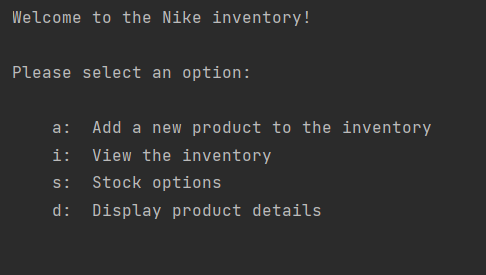
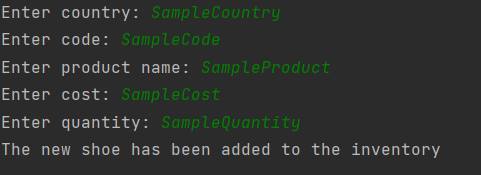
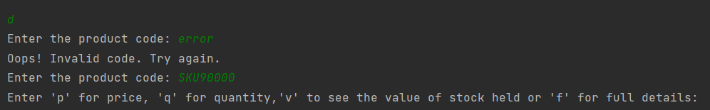
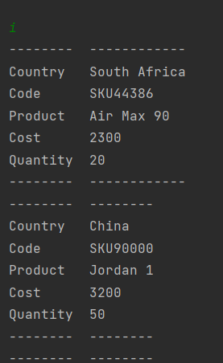
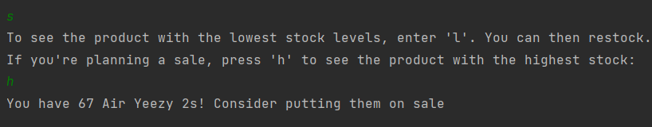
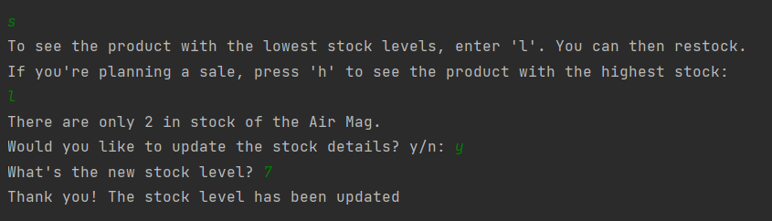

# Nike inventory
## Description
This is a simple program created in Python that uses OOP to emulate the experience of using an inventory program. It allows the user to view and edit an inventory of shoes and perform various functions related to restocking and fact-checking. 
## Built with 
Python
## Installation 
- Install tabulate 
`pip install tabulate`
- Make sure you have the inventory.py file and inventory.txt file in the same folder
## Instructions 
These were the instructions that I was given to guide me in this task. They should give an overview of how the program operates and what I was expected to achieve.

Code a Python program that will read from the text file inventory.txt and perform the following on the data, to prepare for presentation to your managers:

- We’ve provided a template for you in a file named inventory.py. In this file create a class named Shoes with the following attributes:
  - country,
  - code,
  -  product,
  - cost, and
  - quantity.
- Inside this class define the following methods:
  -  get_cost - Returns the cost of the shoes
  -  get_quantity -Returns the quantity of the shoes.
  -  __str__ - This method returns a string representation of a clss
- Outside this class create a variable with an empty list. This variable will be used to store a list of shoes objects
- Then you must define the following functions outside the class:
  - read_shoes_data - This function will open the file inventory.txt and read the data from this file, then create a shoes object with this data and append this object into the shoes list. One line in this file represents data to create one object of shoes. You must use the try-except in this function for error handling. Remember to skip the first line using your code.
  - capture_shoes - This function will allow a user to capture data about a shoe and use this data to create a shoe object and append this object inside the shoe list.
  - view_all - This function will iterate over the shoes list and print the details of the shoes returned from the __str__ function. Optional: you can organise your data in a table format by using Python’s tabulate module.
  - re_stock - This function will find the shoe object with the lowest quantity, which is the shoes that need to be re-stocked. Ask the user if they want to add this quantity of shoes and then update it. This quantity should be updated on the file for this shoe.
  - search_shoe - This function will search for a shoe from the list using the shoe code and return this object so that it will be printed.
  - value_per_item - This function will calculate the total value for each item . Please keep the formula for value in mind; value = cost * quantity. Print this information on the console for all the shoes.
  - highest_qty - Write code to determine the product with the highest quantity and print this shoe as being for sale.
- Now in your main create a menu that executes each function above. This menu should be inside the while loop. Be creative!
## Usage
Select from the following options: 

If 'a' is selected the user is prompted to input the following data, which is then uploaded to inventory.txt

If 'd' is selected the user is asked to enter a product code. If they enter a code that is not already held in inventory.txt they get an error message. Otherwise they are given options for which data they would like to see

If 'i' is selected a breakdown of the data held on each shoe is printed to screen, eg:

If 's' is selected the user has two options. The first one simply finds the shoe with the lowest stock levels in inventory.txt and prints it to screen: 

The second offers the user the ability to update stock levels

## Credits
HyperionDev created the initial inventory.py file, which had a template from which I worked
